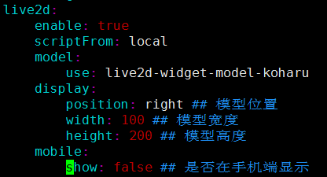

## 添加卡通人物
1. 获取live2d的安装包
`npm install --save hexo-helper-live2d // 在博客项目下进行安装`
2. 下载相应卡通人物模型
`npm install live2d-widget-model-koharu // 在博客目录下进行安装`
3. 修改项目下的_config.yml文件
```
live2d:
    enable: true
    scriptFrom: local
    model:
        use: live2d-widget-model-koharu
    display:
        position: right ## 模型位置
        width: 100 ## 模型宽度
        height: 200 ## 模型高度
    mobile:
        show: false ## 是否在手机端显示
```

## 鼠标点击出现爱心
<!-- more -->
1. 编写/themes/yilia/source/js/love.js文件
```
!function(e,t,a)
{
    function n()
    {
        c(".heart{width: 10px;height: 10px;position: fixed;background: #f00;transform: rotate(45deg);-webkit-transform: rotate(45deg);-moz-transform: rotate(45deg);}.heart:after,.heart:before{content: '';width: inherit;height: inherit;background: inherit;border-radius: 50%;-webkit-border-radius: 500%;-moz-border-radius: 50%;position: fixed;}.heart:after{top: -5px;}.heart:before{left: -5px;}"),o(),r()}
        function r()
        {
            for(var e=0;e<d.length;e++)
                d[e].alpha<=0?(t.body.removeChild(d[e].el),d.splice(e,1)):(d[e].y--,d[e].scale+=.004,d[e].alpha-=.013,d[e].el.style.cssText="left:"+d[e].x+"px;top:"+d[e].y+"px;opacity:"+d[e].alpha+";transform:scale("+d[e].scale+","+d[e].scale+") rotate(45deg);background:"+d[e].color+";z-index:99999");
                requestAnimationFrame(r)
        }
        function o()
        {
            var t="function"==typeof e.onclick&&e.onclick;e.onclick=function(e){t&&t(),i(e)}
        }
        function i(e)
        {
            var a=t.createElement("div");
            a.className="heart",d.push({el:a,x:e.clientX-5,y:e.clientY-5,scale:1,alpha:1,color:s()}),t.body.appendChild(a)
        }
        function c(e)
        {
            var a=t.createElement("style");a.type="text/css";
            try{
                a.appendChild(t.createTextNode(e))
            }catch(t){
                a.styleSheet.cssText=e
            }
            t.getElementsByTagName("head")[0].appendChild(a)
        }
        function s()
        {
            return"rgb("+~~(255*Math.random())+","+~~(255*Math.random())+","+~~(255*Math.random())+")"
        }
        var d=[];
        e.requestAnimationFrame=function(){return e.requestAnimationFrame||e.webkitRequestAnimationFrame||e.mozRequestAnimationFrame||e.oRequestAnimationFrame||e.msRequestAnimationFrame||function(e){setTimeout(e,1e3/60)}}(),n()
    }(window,document);
```
2. 在/themes/yilia/layout/layout.ejs最后一行添加该js文件
```
<!-- 页面点击小红心 -->
<script type="text/javascript" src="/js/love.js"></script>
```
## 添加鼠标点击显示字体效果
1. 编写/themes/yilia/source/js/click_text.js文件
```
var a_idx = 0;
jQuery(document).ready(function($) {
    $("body").click(function(e) {
        var a = new Array
        ("富强", "民主", "文明", "和谐", "自由", "平等", "公正", "法治", "爱国", "敬业", "诚信", "友善");
        var $i = $("<span/>").text(a[a_idx]);
        a_idx = (a_idx + 1) % a.length;
        var x = e.pageX,
        y = e.pageY;
        $i.css({
            "z-index": 5,
            "top": y - 20,
            "left": x,
            "position": "absolute",
            "font-weight": "bold",
            "color": "rgb(" + ~~(255 * Math.random()) + "," + ~~(255 * Math.random()) + "," + ~~(255 * Math.random()) + ")" ## 随机显示颜色

        });
        $("body").append($i);
        $i.animate({
            "top": y - 180,
            "opacity": 0
        },
			3000,
			function() {
			    $i.remove();
			});
    });
    setTimeout('delay()', 2000);
});

function delay() {
    $(".buryit").removeAttr("onclick");
}
```
2. 在/themes/yilia/layout/layout.ejs最后一行添加该js文件
## 添加字数统计功能
1. 安装hexo-wordcount插件
`cnpm i --save hexo-wordcount`
2. 创建/root/Documents/sunjuanBlog/themes/yilia/layout/_partial/post/word.ejs文件
`touch word.ejs`
3. 往word.ejs添加内容
```
<div style="margin-top:10px;">
    <span class="post-time">
      <span class="post-meta-item-icon">
        <i class="fa fa-keyboard-o"></i>
        <span class="post-meta-item-text">  字数统计: </span>
        <span class="post-count"><%= wordcount(post.content) %>字</span>
      </span>
    </span>

    <span class="post-time">
      &nbsp; | &nbsp;
      <span class="post-meta-item-icon">
        <i class="fa fa-hourglass-half"></i>
        <span class="post-meta-item-text">  阅读时长: </span>
        <span class="post-count"><%= min2read(post.content) %>分</span>
      </span>
    </span>
</div>
```
4. 往/root/Documents/sunjuanBlog/themes/yilia/layout/_partial/article.ejs中添加内容
```
<div class="article-inner">
    <% if (post.link || post.title){ %>
      <header class="article-header">
        <%- partial('post/title', {class_name: 'article-title'}) %>
        <% if (!post.noDate){ %>
        <%- partial('post/date', {class_name: 'archive-article-date', date_format: null}) %>
        <!-- 需要添加的位置 -->
        <!-- 开始添加字数统计-->
        <% if(theme.word_count && !post.no_word_count){%>
          <%- partial('post/word') %>
          <% } %>
        <!-- 添加完成 -->
        <% } %>
      </header>
    <% } %>
```
5. 修改文件/root/Documents/sunjuanBlog/_config.yml
#是否开启字数统计
#不需要使用，直接设置值为false，或注释掉
word_count: true

## 添加网站运行时间功能
1. 修改sunjuanBlog/themes/yilia/layout/_partial/footer.ejs文件
```
<span id="timeDate">载入天数...</span><span id="times">载入时分秒...</span>
<script>
    var now = new Date(); 
    function createtime() { 
        var grt= new Date("08/27/2018 12:49:00");//此处修改你的建站时间或者网站上线时间 
        now.setTime(now.getTime()+250); 
        days = (now - grt ) / 1000 / 60 / 60 / 24; dnum = Math.floor(days); 
        hours = (now - grt ) / 1000 / 60 / 60 - (24 * dnum); hnum = Math.floor(hours); 
        if(String(hnum).length ==1 ){hnum = "0" + hnum;} minutes = (now - grt ) / 1000 /60 - (24 * 60 * dnum) - (60 * hnum); 
        mnum = Math.floor(minutes); if(String(mnum).length ==1 ){mnum = "0" + mnum;} 
        seconds = (now - grt ) / 1000 - (24 * 60 * 60 * dnum) - (60 * 60 * hnum) - (60 * mnum); 
        snum = Math.round(seconds); if(String(snum).length ==1 ){snum = "0" + snum;} 
        document.getElementById("timeDate").innerHTML = "本站已安全运行 "+dnum+" 天 "; 
        document.getElementById("times").innerHTML = hnum + " 小时 " + mnum + " 分 " + snum + " 秒"; 
    } 
setInterval("createtime()",250);
</script>
```


