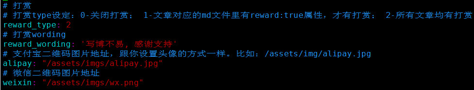
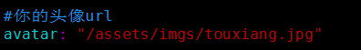
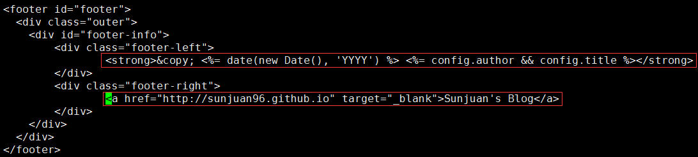
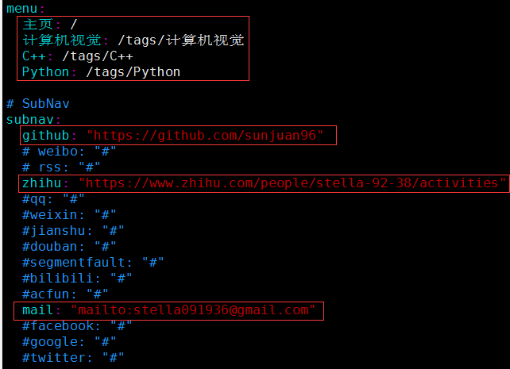
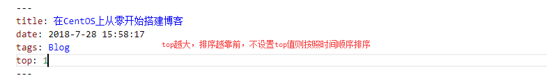

###  添加博客的头像和赞赏二维码
>+ 在项目目录themes/yilia/source下新建一个存放图片的文件夹，并将待添加的图片添加进去
`mkdir -r assets/imgs`
>+ 修改/themes/yilia/_config.yml文件

>+ 修改版权声明：themes/yilia/layout/_partial/footer.ejs

### 添加博客主页左边的内容添加tags
>修改/themes/yilia/_config.yml文件

###  博文指定排序
>+ 修改项目下文件/node_modules/hexo-generator-index/lib/generator.js

>+ 修改项目.md文件

