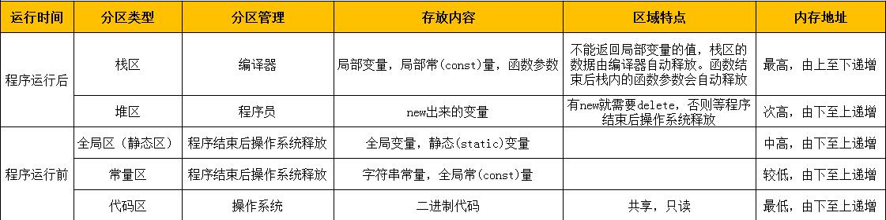
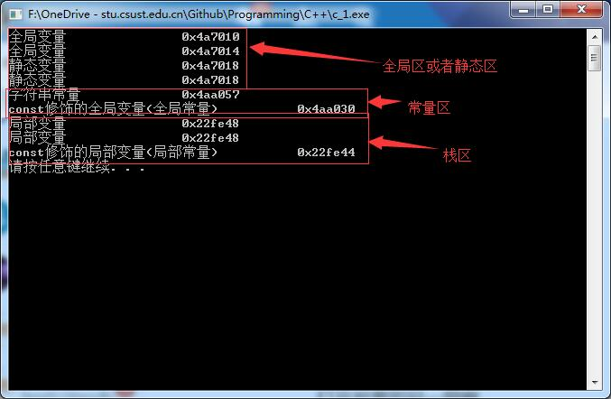

## 1 程序的内存分区模型

**内存分区模型的意义：** 不同区域存放的数据，具有不同的声明周期，可以灵活编程

**内存分区模型的表示：**



**内存分区模型的代码运行结果展示：**



**new运算符**
* 语法1： new一个数据，返回数据的指针，即数据的地址

`数据类型 * 数据名称 = new 数据类型(数据内容)`

`int * a = new int(10);`

`delete a;`

* 语法2： new一个数组，返回数组的首地址

`数据类型 * 数组名 = new 数据类型[数组大小]`

`int * arr = new int[5];`

`delete[] arr;`

## 2 C++引用

**作用**  给变量起别名，可以通过别名对变量进行修改

**基本语法**  `数据类型 & 别名 = 原名`
`int a = 10; int & b = a;`

**注意事项**  引用必须初始化，并且初始化后不可更改

```
int a = 10, c = 20;
int &b;//错误命令，引用必须初始化
int &b = a;

b=c; // 赋值操作，此操作后a=b=20
```

**作为函数的返回值**  引用可以作为函数的返回值，但是不可以返回局部变量的引用，函数调用可以作为左值的存在

```
int& test()
{
    int a = 10;
    static int b = 20;

    // return a;// 错误，局部变量存在栈区，生命周期短

    return b; //正确，静态变量存在全局区，声明周期长
}

int main()
{
    int & ref = test();

    // 别名为b的数据的值为10，输出ref为10

    test() = 1000; // 函数返回值为引用，函数可以作为左值

    // 修改别名为b的数据的值为1000，输出ref为1000

    system("pause");
    return 0;
}
```

**引用的本质**  指针常量，指针指向不可修改，指针指向的值可以修改

内部实现 `int* const a = &ref;`

**常量引用**  常量引用主要用于修饰形参，避免误操作 **语法** `void show(const int &ref)`

## 3 函数参数的传递方式

|   | 值传递 | 地址传递 | 引用传递 |
|:--:|:--:|:--:|:--:|
| 参数作用 | 形参不能修饰实参 | 形参修饰实参 | 形参修饰实参 |
| 函数头定义 | `swap(int a, int b)` | `swap(int *a, int *b)` | `swap(int &a, int &b)` |
| 函数体定义 | `int temp = a; a = b; b = temp;` | `int temp = *a; *a = *b; *b = *temp` | `int temp = a; a = b; b = temp;` |
| 函数调用 | `swap(a, b)` | `swap(&a, &b)` | `swap(a, b)` |

## 4 函数高级知识点

**函数默认参数** `函数返回值 函数名 (参数=默认值){}`

`int func(int a, int b, int c = 10)`

如果有函数参数有默认值，则在函数调用的时候有传参就用传入的参数值，没有传参就用默认的参数值

* 函数声明和函数实现中的默认值只能二选一
* 如果某个位置参数有函数默认值，则该位置后面的所有位置参数，从左至右，都需要有函数默认值

**函数占位符**  `函数名 (数据类型)`

`int func(int a, int)`

`int func(int a, int = 10)`

**函数重载** 

* 同一作用域下
* 函数名相同
* 函数参数类型，参数个数，顺序不同
* **函数的返回值**不可以作为函数重载的条件
* 引用作为函数重载的条件，碰到const修饰的引用需要注意
* 函数重载碰到默认参数，容易出现二义性，尽量**避免函数重载和默认参数碰到**