### 安装Texlive+TexStudio
1. 下载Texlive镜像后解压
[下载离线安装包](http://www.tug.org/texlive/)
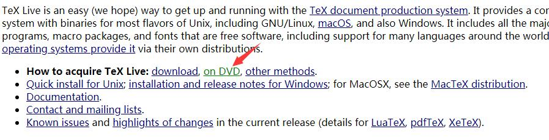


2. 安装Texlive

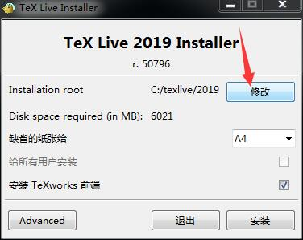
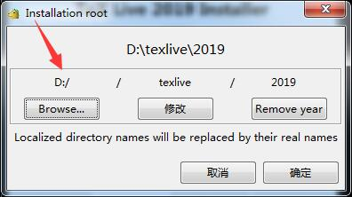
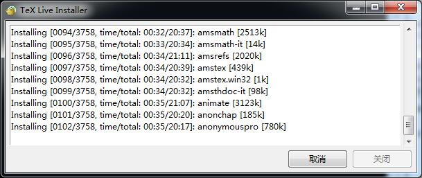
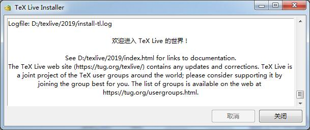
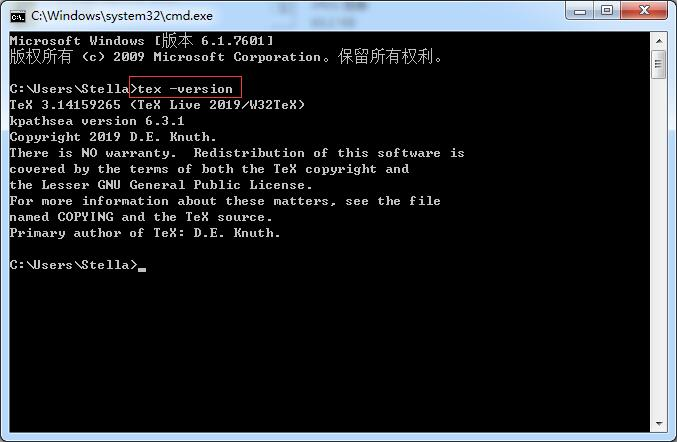
3. 安装配置TexStudio
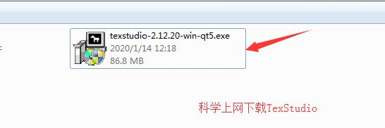
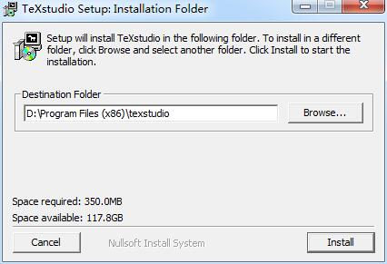
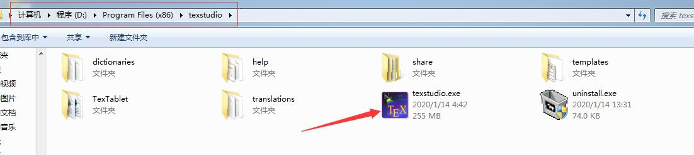
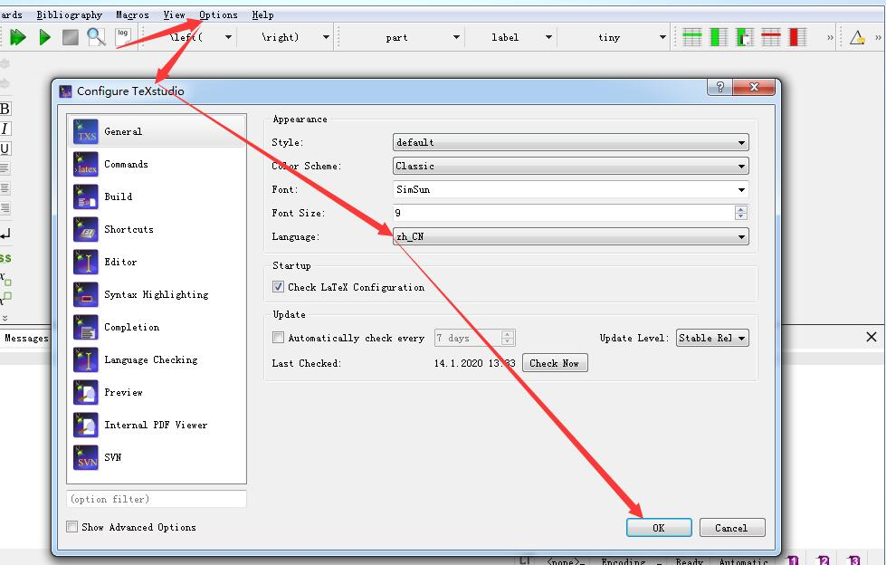

### LaTex技能
1. LaTex添加图片
第一步，将Word或者Visio的**单张图**保存为PDF格式
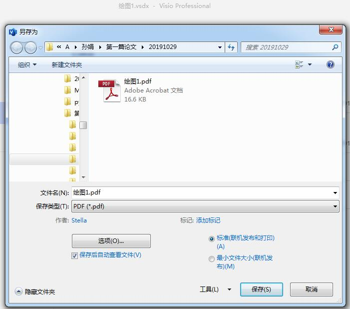
第二步，将PDF的图打开裁剪并保存为**eps格式**的图片
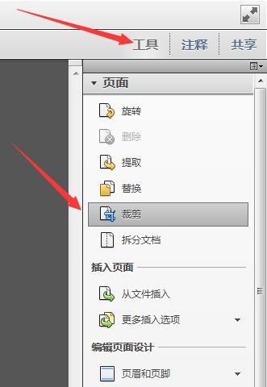
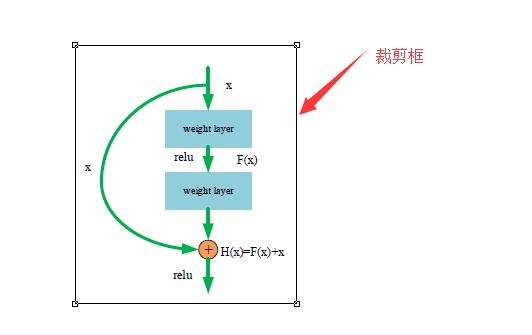
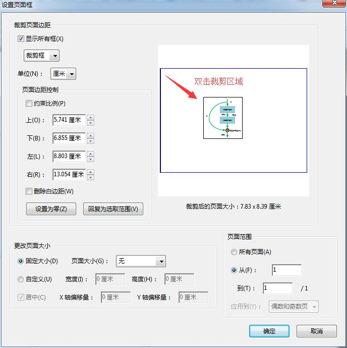
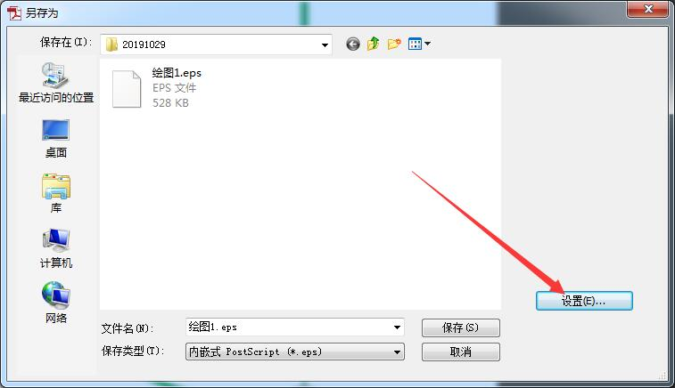
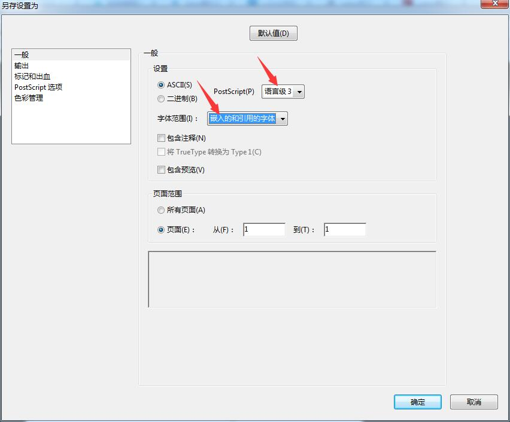
第三步，将eps文件添加至.tex文件中
```
\begin{figure}[ht]
	\centering\includegraphics[width=11cm,height=8cm]{FlowChart.eps}
	\caption{Comprehensive Framework of Our Tracking Algorithm.}\label{fig:FlowChart}
\end{figure}
```
参数说明：
**\begin{figure}**开头，**\end{figure}**结束，中间添加图片
**[ht]**表示图形放置位置优先级从左至右。
**h**表示当前位置。将图形放置在正文文本中给出该图形环境的地方。如果本页所剩的页面不够，这一参数将不起作用。
**t**表示页面顶部。将图形放置在页面的顶部。
**b**表示底部。将图形放置在页面的底部。
**p**表示浮动页。将图形放置在一只允许有浮动对象的页面上。
**\centering** 居中显示图片
**\includegraphics[width=11cm,height=8cm]{FlowChart.eps}** 添加FlowChart.eps中的图片，设置图片的宽高分别为11cm和8cm
**\caption** 设置图片的标题
**\label** 设置图片的标签，方便引用
```
\begin{figure}[ht]
\begin{flushleft}
	\includegraphics[width=11cm,height=8cm]{FlowChart.eps}
	\caption{Comprehensive Framework of Our Tracking Algorithm.}\label{fig:FlowChart}
\end{flushleft}
\end{figure}
```
**\begin{flushleft}和\end{flushleft}**表示左对齐，同理还有flushright

**\textit**{斜体内容}：


### 配置JAVA环境和安装JabRef文献管理工具
1. 配置新变量JAVA_HOME：D:\Program Files\Java\jdk1.8.0_241
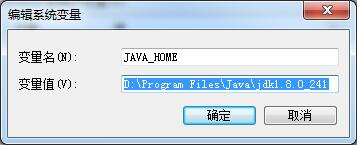
2. 配置旧变量Path：%JAVA_HOME%\bin;%JAVA_HOME%\jre\bin;
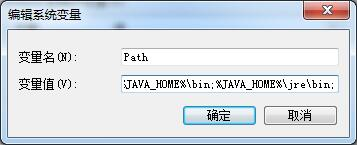
3. 配置新变量CLASSPATH：.;%JAVA_HOME%\lib\dt.jar;%JAVA_HOME%\lib\tools.jar;
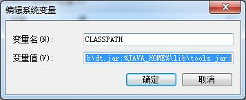