### Git的介绍
1. Git是世界上最先新的分布式版本控制系统
2. Git和SVN的区别
| Git | SVN |
| :---: | :---: |
| 分布式版本控制系统 | 集中式版本控制系统 |
| 每台电脑有一份代码 | 中心服务器有一份代码 |
| 中心服务器出问题，仍然可以工作 | 中心服务器出问题，所有人无法工作（安全性低） |
| 工作时无需联网 | 工作时需联网，且网速过慢提交文件慢 |
| 新建分支合并分支速度快 | 新建分支相当于复制一份代码 |
>中心服务器：交换每个用户的修改，没有中心服务器也能工作，但是中心服务器能够 24 小时保持开机状态，这样就能更方便的交换修改。
3. Git和Github的区别
| Git | Github |
| :---: | :---: |
| 用于记录若干文件内容变化的软件 | 提供Git管理服务的一个网站，可以保存代码等（一个中心服务器） 
4. 注册一个Github账户
5. 本地电脑安装Git
6. Git本地区域
>工作区：添加、删除、编辑文件
>暂存区：暂存已经修改的文件，最后统一提交到仓库中
>Git仓库：最终提交的文件保存到仓库，并成为一个新的版本，对他人可见
>工作流程：工作区->暂存区->Git仓库
7. Git的使用
> 仓库：repository，用来存放代码的目录
> 在github上添加本机的公钥，将id_rsa.pub内容复制到github账户中
```
ssh-keygen -t rsa -C "stella091936@gmail.com" // 生成秘钥在C:\Users\Stella\.ssh中
```
> 本地全局配置
```
// 点击git bash here
git config --global user.name "用户名"
git config --global user.email "邮箱地址"
```
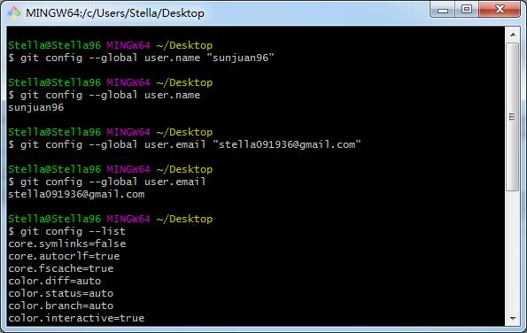
> 管理新项目或者已存在项目（不建议在已有项目上进行）
```
mkdir pro1 //创建目录：mkdir 项目名称
cd pro1 //进入目录
git init //项目初始化
```
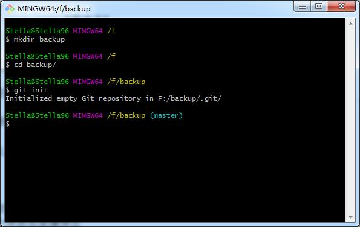
>git常用指令操作
```
git status //查看当前状态
git add 文件名 //将文件添加至缓存区
git commit -m "注释内容" //提交至版本库
```
> git add的几种用法
```
git add 文件1
git add 文件1 文件2 文件3 
git add . // 将当前目录添加至缓存区
```
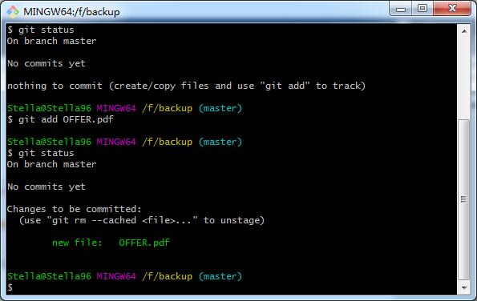
> 将缓存区的内容提交至版本库
```
git commit -m "剑指offer第二版"
```
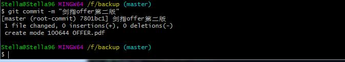
> 版本回退操作
```
git log //查看版本显示1
git log --pretty=oneline //查看版本显示2，获取版本号的字符串
git reset --hard 版本号 //回到版本号的文件版本
```
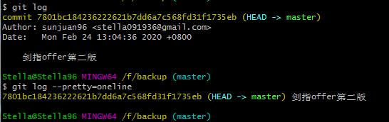
> 版本回退之后回到未来
```
git reflog //查看历史操作记录
git reset --hard commit_id //commit_id是git的操作记录编号，至少些编号的前4位
```
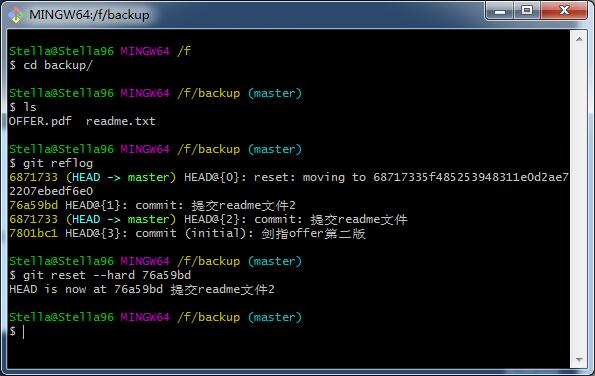
8. 远程线上仓库的使用(Github为例)
> Github创建一个线上空仓库
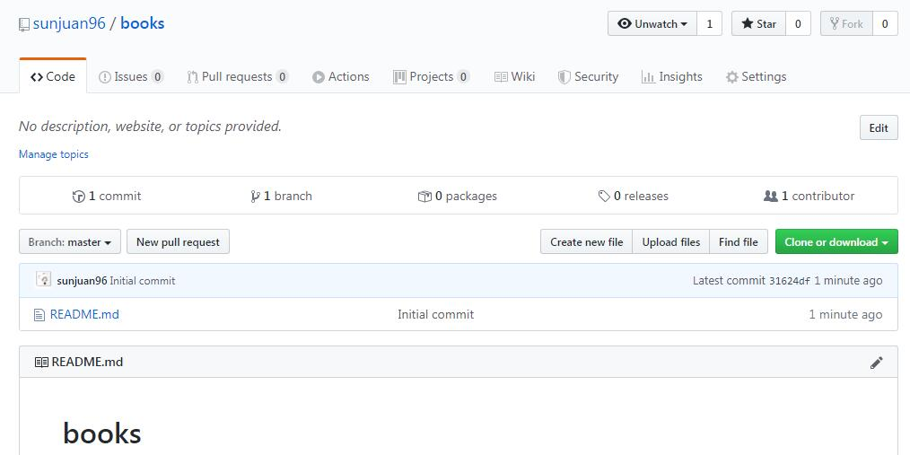
> 使用HTTP协议的线上仓库
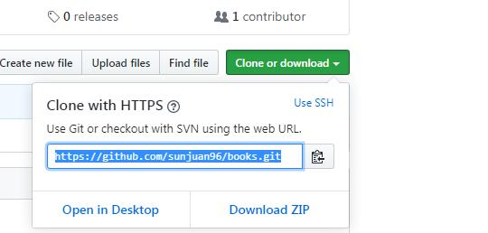
```
git clone https://github.com/sunjuan96/books.git //使用clone指令将线上仓库克隆到本地
cd books
git add text1.txt //提交暂存区
git commit -m "提交text1.txt文件" // 提交本地仓库
git push // 提交线上远程仓库，第一次提交会出现403的错误，需要登录github账户授权。
```
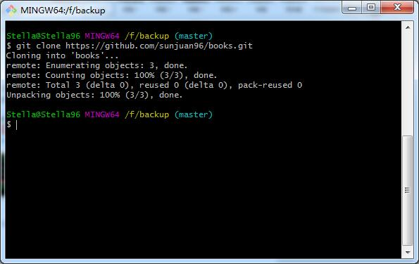
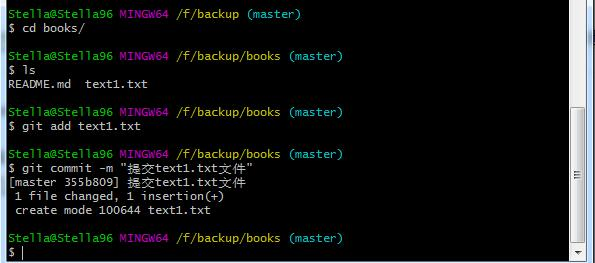
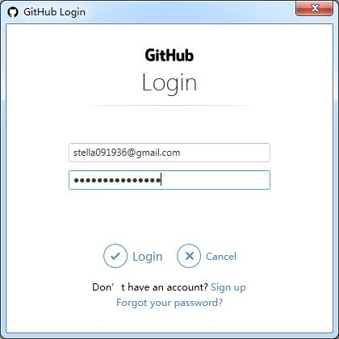
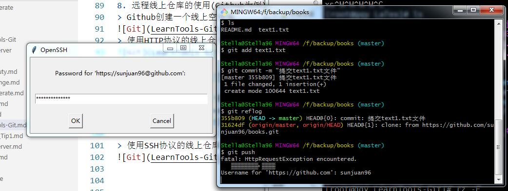
修改.git/config同样也可以授权
```
[remote "origin"]
	url = https://github.com/sunjuan96/books.git
	fetch = +refs/heads/*:refs/remotes/origin/*
修改为：
[remote "origin"]
	url = https://sunjuan96:密码@github.com/sunjuan96/books.git
	fetch = +refs/heads/*:refs/remotes/origin/*
```
```
git pull //拉取线上仓库，保证本地和线上的内容一致
```
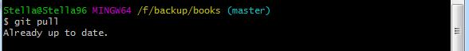

> 使用SSH协议的线上仓库(更建议这种方式)
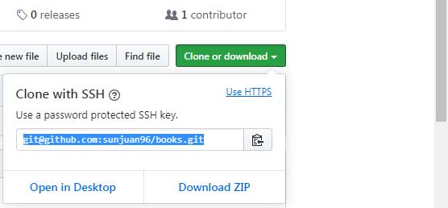
首先需安装OpenSSH，并通过Github注册的邮箱在本机生成公秘私钥对，将公钥复制到Github中
```
ssh-keygen -t rsa -C "stella091936@gmail.com" // 生成秘钥在C:\Users\Stella\.ssh中
```
```
git clone git@github.com:sunjuan96/books.git //使用clone指令将线上仓库克隆到本地
cd books
git add text1.txt //提交暂存区
git commit -m "提交text1.txt文件" // 提交本地仓库
git push // 提交线上远程仓库，不需要配置github的账户和密码
```
9. 分支管理
> 分支代表项目不同的模块，鼓励用分支进行项目的开发
> 分支的有关命令
```
git branch //查看分支，当前所在的分支会有一个*号的标记
git branch 分支名 // 创建分支
git checkout 分支名 // 切换分支
git checkout -b 分支名 // 创建并切换分支
git branch -d 分支名 // 删除分支。待删除分支不能处于使用的状态
git merge 被合并的分支名 //合并分支
git push // 保证远程线上的分支和文件和本地保持一致
```
10. 冲突的产生和解决(多人开发)
A下班将修改的文件TXT进行push后，B又修改了TXT文件
A上班未pull直接在TXT上进行修改，A下班的时候进行push报错，提示需要先pull后再push
A进行push后再pull，git会直接将TXT文件的冲突合并，保留有注释
A和B商量对TXT具体如何修改，修改后提交并push到线上。
11. 图形化管理工具（非必须）
> Github for Desktop
> Source tree
> TortoiseGit，和TortoiseSVN一样是非常好用的开源版本管理工具
> Git GUI here
12. 忽略文件，用来处理不改变或者改变了也不想提交到线上的内容
```
cd 
touch .gitignore // git的bash下创建名为.gitignore的文件
```
> 修改新创建的.gitignore的内容
13. git删除远程的文件或者文件夹
```
git rm -r 文件夹 // 同时删除本地和仓库中的文件
git rm -r --cached 文件夹 // 只删除仓库中的文件，保留本地文件
git commit -m '删除了文件夹' //提交操作说明
git push -u origin master // 将本次更改更新到github项目上去
```

注：教程来自黑马程序员，侵删！


