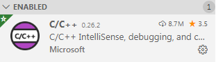
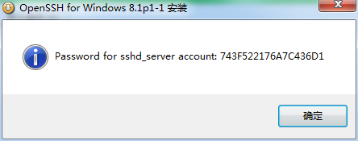
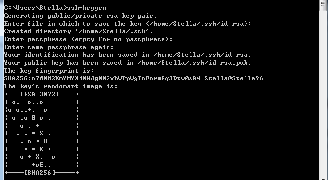
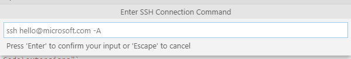
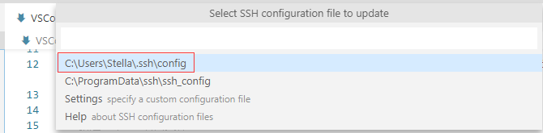
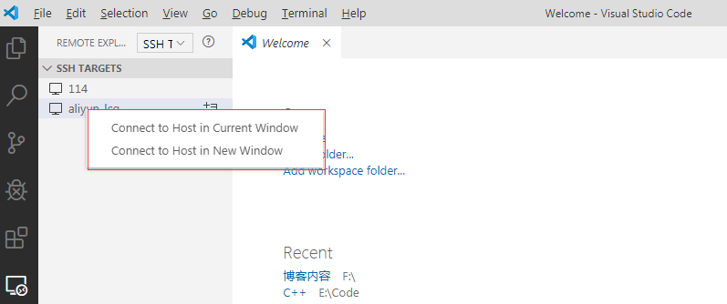
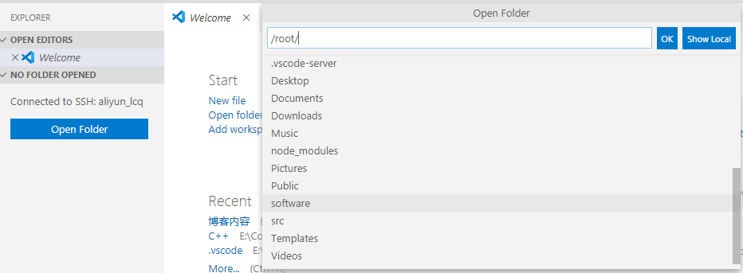

### VSCode的安装和C++运行环境的配置
1. 下载离线安装包：VSCode-win32-x64-1.41.1.zip 再解压
2. 下载TDM-GCC，并安装，将其加入到环境变量中D:\TDM-GCC-64\bin;
3. 自定义插件安装位置，新建一个文件夹存储插件
4. 修改VSCode的快捷方式
`原本的目标 --extensions-dir "新的存储位置"`
`"D:\Program Files\Microsoft VS Code\Code.exe" --extensions-dir "D:\Program Files\Microsoft VS Code\extensions"`
5. 下载和C、C++有关的插件

6. 新建一个C++项目文件
7. 项目文件夹下新建.vscode文件夹
8. 向文件夹中添加lauch.json和tasks.json文件
9. 运行Debug
10. 参考网址https://www.zhihu.com/question/30315894

### VSCode运行远程开发目录
1. 设置Windows下免密登录
> + 安装SSH软件
> + 
> + Windows的DOS下输入：ssh-keygen。一直回车
> 
> + 将C:\Users\用户名\.ssh目录下的公钥id_rsa.pub拷贝到服务器
> + 服务器中输入:cat id_rsa.pub >> ~/.ssh/authorized_keys
2. VSCode的Extension中安装Remote Development
3. VSCode中配置远程连接
> + 编辑连接名称

> + 选择配置文件

4. 编辑配置文件
```
Host aliyun_lcq
  HostName 阿里云IP
  User root
  Port 22
Host 114
  HostName 服务器IP
  User slf
  Port 22
```
5. 打开服务器上的文件夹


6. 编辑服务器上的文件直接保存就可以上传至服务器

